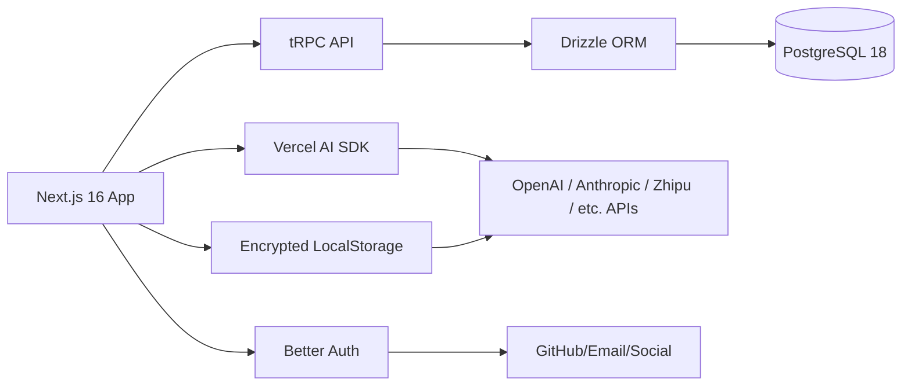

# **Product Requirements Document (PRD)**  
**Product Name:** Arcade Vibe  
**Version:** 1.0 – MVP  
**Date:** 2025-04-05  

---

## **1. Overview**

### **Executive Summary**
Arcade Vibe is a *competitive prompt engineering platform* that gamifies the art and science of one-shot AI game generation. Rooted in retro arcade aesthetics, the platform challenges users to craft a *single, self-contained prompt*—with no history or context—that generates a fully playable game in a target AI model. Every month, a new theme is released, and users compete across difficulty tiers (models), with a holistic scoring system that rewards creativity, efficiency, and engagement.

It transforms prompt engineering into a spectator *and* participatory sport:  
✅ Prompt engineers = players  
✅ Players = community testers/raters  
✅ Leaderboards = immortal legacy  

---

## **2. Objectives**

### **Business Objectives**
- Launch a compelling, self-sustaining creative competition platform in <6 months  
- Achieve 500+ active prompt engineers and 2,000+ games submitted by Month 3  
- Drive virality through prompt reuse and leaderboard prestige  

### **Technical Objectives**
- **Strict stack alignment**: All components must follow the defined tech stack (Next.js 16 + tRPC v11 + Drizzle ORM + Better Auth, etc.)
- **100% client-side model invocation** (API keys via user-encrypted storage)
- *Zero* persistent context across prompts (pure single-shot generation)
- Sub-second UI responsiveness for game previews and prompts

### **Success Metrics (KPIs)**
| Metric | Target (Month 3) |
|-------|------------------|
| Avg session duration (game) | ≥ 3 min |
| % entries rated ≥4 stars | ≥ 65% |
| Prompt reuse ratio (runs / submissions) | ≥ 0.3 |
| Retention Rate (Month 2 return) | ≥ 40% |
| Model diversity (≠ Opus-4.6) | ≥ 60% of entries |

---

## **3. Target Audience**

### **User Personas**
| Persona | Goals | Pain Points |
|--------|-------|-------------|
| **Prompt Engineer (Creator)** | Win monthly rankings, master model quirks, share knowledge | Lack of structured competition, no benchmarking, model inconsistency |
| **Player (Consumer)** | Engage with creative AI games, understand how prompts work | No transparency in generation, game variety fatigue |
| **Casual Learner** | Improve prompt crafting skills by observing/running winners | Overwhelmed by open-ended experimentation |

### **User Stories**
> *As a prompt engineer, I want to compare outputs across multiple models in one run, so I can assess which model my prompt works best on.*

> *As a player, I want to see the prompt used to generate a game, so I can learn how clever prompts produce clever games.*

> *As a creator, I want to fork & iterate my own prompts privately before publishing, so I can refine without premature exposure.*

---

## **4. Features**

### **4.1 Core Features (MVP)**

#### **A. Monthly Challenge Lifecycle (System)**  
- [ ] Monthly theme announcement (e.g., *“A Space Station with Time Loops”*)  
- [ ] Immutable core requirements ( enforced schema ):
  ```ts
  const GAME_REQUIREMENTS = {
    scoringSystem: true, // e.g., points, combos
    lives: true,         // 1–9, persist across resets
    levels: true,        // ≥2 levels with escalation
    responsive: true,    // Canvas or DOM must scale to window
    iframe: true,        // Must be embeddable in <iframe>
  }
  ```
- [ ] Auto-freeze & archive submissions on month-end (no edits post-deadline)  
- [ ] Public leaderboard resets monthly (legacy games stay, rankings frozen)  

#### **B. Submission & Generation Workflow (Creator)**  
- [ ] Prompt editor: Full-text field, no context injection  
- [ ] Model selector:  
  ```txt
  [GPT-5.3 | Opus-4.6 (Cheater)]
  [GLM-4.7 | Kimi-k2.5 (Normal)]
  [Deepseek-3.2 | GPT-5.1-mini | Haiku-4.5 (Hard)]
  [Tiny models (Impossible)] // e.g.,Phi-3-mini
  ```
  - *Multi-select allowed* (run same prompt on multiple models)
- [ ] Prompt versions + forks with diff view & timestamped history  
- [ ] Privacy control:  
  - `private` → only visible to creator  
  - `public_on_archive` → visible only after month ends  
  - `public_immediate` → visible now  
- [ ] Live preview: Inline iframe of generated game (post-generation)

#### **C. Scoring Engine (Creator)**  
- **Score Formula** (normalized 0–100):  
  ```
  Score = (
    0.35 × AvgRating (1–5) 
    + 0.20 × ModelHandicapMultiplier (see below) 
    + 0.15 × PromptBrevityBonus (log scale, chars ≤ 300 = +15)
    + 0.20 × AvgPlaytime (capped at 10 min, minutes / 10 × 20)
    + 0.10 × VoteVolume (sigmoid, 100 votes = +10)
  ) × 100
  ```

  | Model Tier         | Multiplier |
  |--------------------|------------|
  | Opus-4.6 (Cheater) | ×1.0       |
  | Normal (GLM/Kimi)  | ×1.25      |
  | Hard (DS3.2/GPT-mini/Haiku) | ×1.50 |
  | Impossible (Tiny)  | ×2.0       |

- [ ] Real-time score estimator (live feedback on editing)  
- [ ] Explanation tooltip for each scoring factor  

#### **D. Arcade Explorer (Player)**  
- [ ] Browse games by month, rating, model, or theme  
- [ ] Difficulty badge per game (color-coded model tier)  
- [ ] **Prompt Toggle**: Show/hide prompt in game view  
- [ ] One-click “Run This Prompt” button:  
  - User enters API key (stored in encrypted localStorage)  
  - Model selector (preselected to match original, but changeable)  
  - Runs prompt again in browser → new game version  
  - *Recorded as “run” in leaderboard analytics*

#### **E. Profile & History**  
- [ ] Creator: List of submissions (with status: draft, published, archived)  
- [ ] Creator: Prompt evolution timeline (fork tree view)  
- [ ] Player: History of runs, ratings, favorite prompts  
- [ ] Public “Prompt of the Month” gallery with high-score prompt breakdown  

---

### **4.2 Future Features (Post-MVP)**  
- **Team Mode**: Collaborative prompts (shared editing, role splits)  
- **Live Jams**: 24-hour leaderboard sprints (with streaming overlay)  
- **Prompt Marketplace**: Buy/sell prompts with royalty system  
- **Model Leaderboard**: Track which models generate highest-rated games  
- **Genre Tags**: Auto-categorize by gameplay genre (e.g., platformer, puzzle)  
- **Diff Tool**: Compare two prompts side-by-side on same model  

---

## **5. Technical Requirements**

### **Tech Stack (Non-Negotiable)**  
| Layer            | Choice                | Notes |
|------------------|-----------------------|-------|
| Frontend         | Next.js 16 (App Router) | SSR for game previews |
| API              | tRPC v11              | End-to-end typing |
| Database         | Drizzle ORM (Postgres 18) | JSONB for prompts & game configs |
| Auth             | Better Auth            | GitHub/email/social logins |
| Styling          | Tailwind v4 + shadcn/ui | Retro arcade theme (neon, CRT scanlines) |
| AI Integration   | Vercel AI SDK v6      | `streamText`, `generateText`, client-only |
| Validation       | Zod v4                 | Shared schemas across server/client |
| Hosting          | Vercel                 | Edge functions for prompt generation |

### **System Architecture Overview**


### **Security Requirements**  
- API keys stored in *encrypted localStorage* (AES-256 + user password)  
- *No* server-side API proxying (client → AI directly)  
- Rate limits per API key (50 calls/user/month)  
- Input sanitization: HTML/JS filters on iframe content (e.g., CSP headers, sanitizers like DOMPurify)

### **Performance Requirements**  
| Metric | Target |
|--------|--------|
| First Contentful Paint | <1.0s (LCP) |
| Time to Interactive | <2.5s |
| Prompt generation latency (client) | ≤15s (p95) |
| Game iframe load | <2.0s |

---

## **6. Timeline & Milestones**

| Phase | Weeks | Deliverables |
|-------|-------|--------------|
| **Discovery & Design** | W1–W2 | Core UX flow, database schema, model selection UX, theme engine |
| **MVP Build (Core)** | W3–W8 | Auth, submission pipeline, generation client, scoring engine, arcade browser |
| **Soft Launch (Month 1)** | W9–W10 | Theme “Retro” released, internal beta, early community testing |
| **Month 1 Live** | W11–W14 | Full production run, leaderboard, analysis dashboards |
| **Post-Launch Review** | W15+ | Bug fixes, retention features, Q2 roadmap |

---

## **7. Open Questions & Risks**

### **Risks**
- **Prompt injection abuse**: Malicious prompts attempting XSS or API misuse → mitigate with iframe sandboxing & Content-Security-Policy
- **Model cost**: Client-side generation means users pay their own API costs—but may lead to low participation if key providers (e.g., OpenAI) restrict AI-generated game terms. → *Add clear disclaimer & encourage open models*
- **Low model diversity**: Most will use Cheater tier → *increase multiplier spread (e.g., Tiny = ×2.5), highlight “Impossible” winners*

### **Open Questions**
1. Should we provide a *reference engine* (e.g., a basic canvas skeleton) to reduce boilerplate?  
   → *MVP: No. Keep it pure prompt. v2 may include optional starter templates.*

2. How to detect non-iframe-compatible games?  
   → *Auto-sandbox test in client: try embedding & listen to `onload` or timeout.*

3. Should we allow *multi-file* prompts (e.g., JSON config + HTML + JS)?  
   → *MVP: No. Single text only. Future: structured payloads via JSON wrapper.*

---

## **Final Notes**

Arcade Vibe isn’t just a tool—it’s a *new competitive discipline*.  
This PRD defines the minimal viable product to launch Month 1 with authenticity, depth, and competitive integrity—where every prompt tells a story, and every game is a testament to prompt mastery.

**"One prompt. One shot. One month to prove you're the best prompt engineer."**  
Let’s build the arena. 🕹️🔥

---  
*PRD authored by: [Your Name]  
Approval: Product + Engineering + AI Governance*  
*Next: UI/UX prototype review → W2*